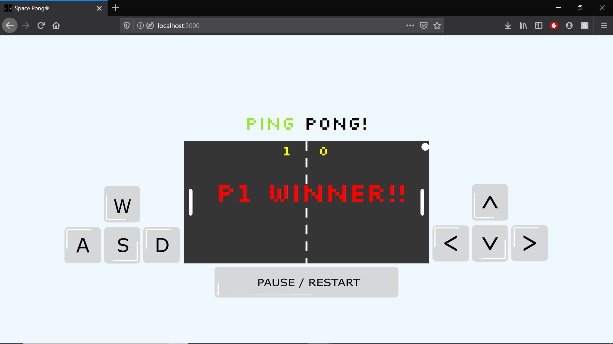

# Pong Game 

Basic ping pong game using SVGs and Javascript to animate and react to pressed key events .

## LEARNINGS 

How to implement OOP Javascript into this game to react on users event and make fun and intereactive animations.

## TOOLS

- VS code 
- SVG's
- JavaScript

## Setup the Game 

* Clone the git repository — `git clone
  https://github.com/OM-AN27/PONG-game-project.git`  

* Install with [npm](https://www.npmjs.com/): `npm install`.

* Run `npm run start` on the git bash 

